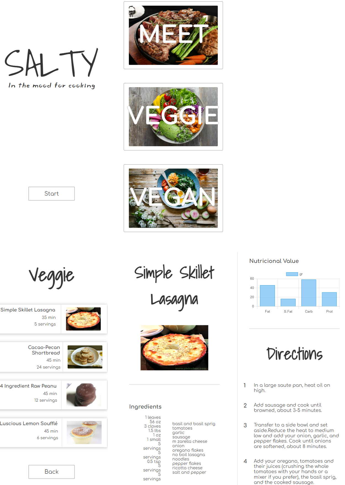
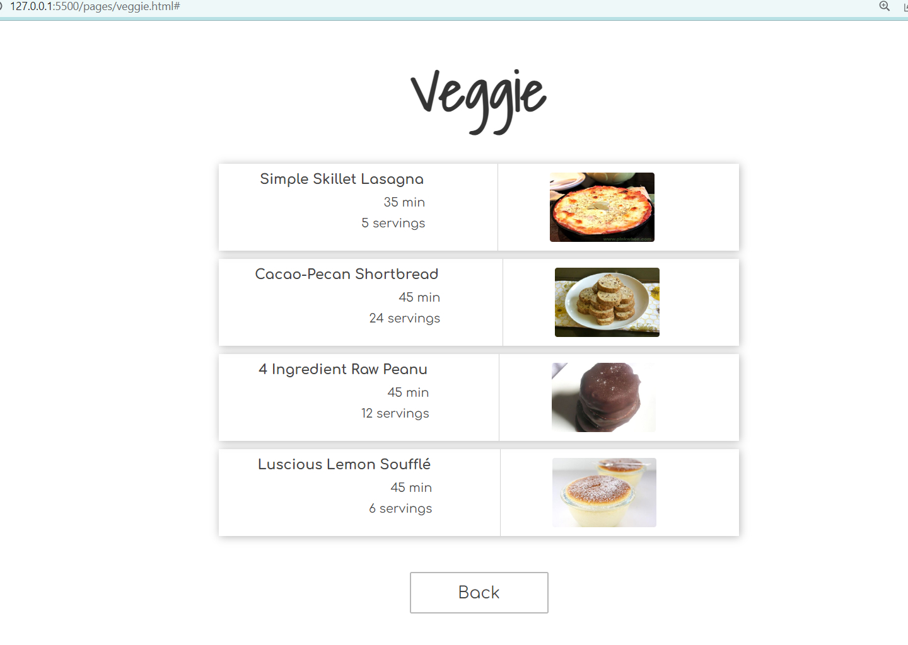
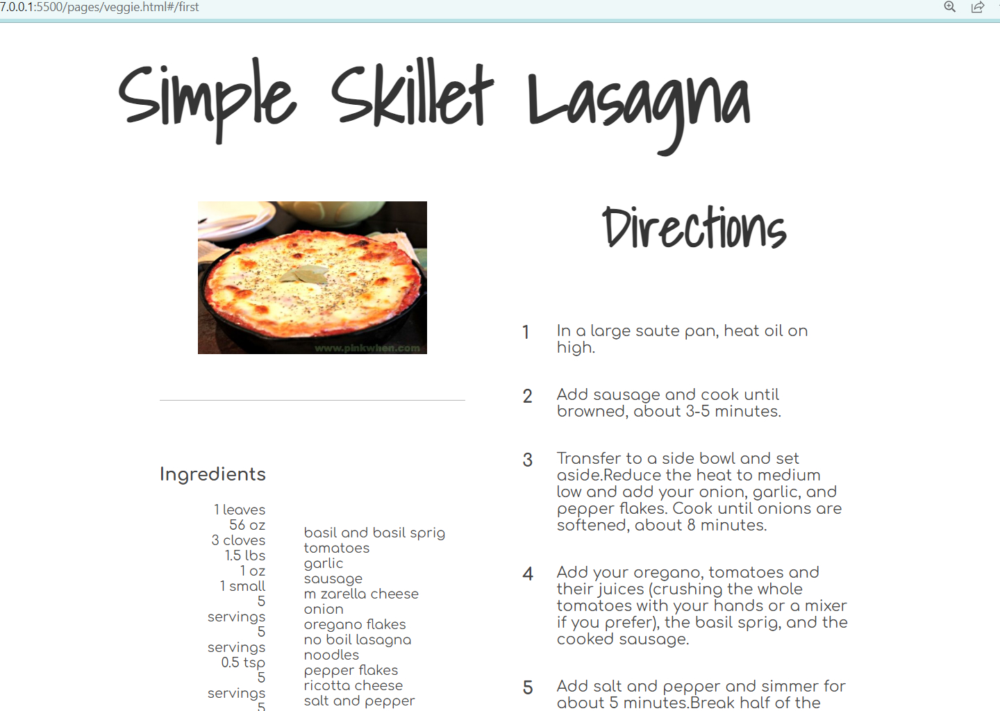

# Proyecto personal - SALTY

Página de sugerencia de recetas en función del tipo de dieta.

## Tabla de contenidos

- [Objetivo](#objetivo)
  - [Fases](#fases)
  - [Capturas](#capturas)
  - [Links](#links)
- [Proceso](#Proceso)
  - [Construido con](#construido-con)
  - [Puntos clave](#puntos-clave)
  - [Aspectos a mejorar](#aspectos-a-mejorar)

## Objetivo

- Elusuario podrá escoger entre tres tipos de dieta: carnívora, vegetariana, vegana.
- Se mostrarán cuatro recetas en función de la dieta elegida.
- Al entrar en una receta se podrá ver: ingredientes, valor nutricional e instrucciones.

### Fases

- FASE 1: Diseño del front: Diseño responsive, mobile first, semántica HTML5.
- FASE 2: Lógica de JavaScript.
- FASE 3: Asincronía: Mostrar datos proporcionados por la API Spoonacular.
- FASE 4: Navegación 1. Mostrar cuatro recetas aleatorias y las pantallas de cada receta.
- FASE 5: Navegación 2. Mostrar los tres tipos de dieta y las recetas aleatorias en función de la dieta.
- FASE 6: Página de inicio y navegación completa.

### Capturas

### Links

- Repositorio: [satly](https://github.com/Radu-A/salty)
- Live Site: [Demo](https://github.com/Radu-A/salty)

## Proceso

### Construido con

- HTML5 semántico
- CSS
- Flexbox
- Mobile-first workflow
- Diseño SPA

### Puntos clave

- Diseño SPA. Aprender la lógica del evento "cambio de Hash" y emplearlo para navegar dentro de una misma página
- Diferentes conexiones a la API según lo requerido
- Maquetar una página construida completamente con texto y elemetos dinámicos
- Navegar teniendo en cuenta las peticiones a la API y la generación de elementos dinamicos

### Aspectos a mejorar

- Planificar adecuadamente el contenido HTML que se se va a generar con Javascript para mejorar el diseño con CSS
- Aumentar funcionalidades
